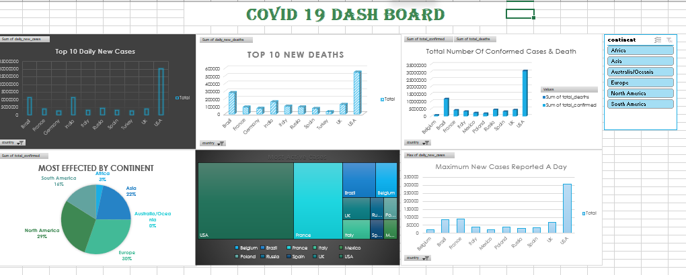

# Covid-19 Dashboard Project

## Project Description
This project presents an interactive **Covid-19 Data Analysis Dashboard** built using **Microsoft Excel**.  
The dashboard analyzes global Covid-19 data and provides visual insights into cases, deaths, and active infections across different countries and continents.

The goal of this project is to transform raw Covid-19 data into an interactive and easy-to-understand dashboard that helps users quickly explore key statistics and trends.

---

## Problem Statement
During the Covid-19 pandemic, large amounts of data were reported daily from different countries.  
Analyzing this data manually can be difficult and time-consuming. Therefore, a visual dashboard is required to summarize important insights such as:

- Countries with the highest number of new cases
- Countries reporting the most deaths
- Most affected continents
- Countries with the highest active cases
- Overall confirmed cases and deaths
- Daily case trends

This dashboard helps present these insights in a simple and interactive way.

---

## Project Objectives
The dashboard answers the following analytical questions:

- Top 10 countries with the highest **new Covid-19 cases**
- Top 10 countries with the highest **new deaths**
- Identify the **most affected continents**
- Countries with the **highest active cases**
- Total number of **confirmed cases and deaths**
- Maximum **new cases reported by day**
- Create an **interactive slicer to filter data by continent**

---

## Tools and Technologies Used

- Microsoft Excel
- Pivot Tables
- Pivot Charts
- Excel Slicers
- Data Cleaning
- Data Visualization

---

## Dataset Information

The dataset contains global Covid-19 statistics including:

- Country
- Continent
- Date
- Total Cases
- New Cases
- Total Deaths
- New Deaths
- Active Cases

This dataset is used to perform analysis and build interactive visualizations.

---

## Dashboard Features

- Interactive filtering using slicers
- Multiple pivot charts for visual analysis
- Comparison between countries and continents
- Clear summary of cases and deaths
- Easy-to-understand visual insights

---

## Dashboard Preview

---

## Project Structure
Covid19-Dashboard
├── dataset.csv
├── covid_dashboard.xlsx
├── dashboard.png
└── README.md

### File Description

| File | Description |
|-----|-------------|
| dataset.csv | Covid-19 dataset used for analysis |
| covid_dashboard.xlsx | Excel file containing pivot tables, charts and dashboard |
| dashboard.png | Screenshot preview of the dashboard |
| README.md | Project documentation |

---

## Key Insights

- Identified countries with the highest Covid-19 cases
- Compared continents based on infection rates
- Analyzed trends in daily new cases
- Identified countries with the highest active cases

---

## Learning Outcomes

Through this project, the following skills were developed:

- Data cleaning and preparation
- Data visualization using Excel
- Creating interactive dashboards
- Using pivot tables and slicers for analysis

---

## Author

Adith K

---

## License

This project is created for **educational and learning purposes**.
